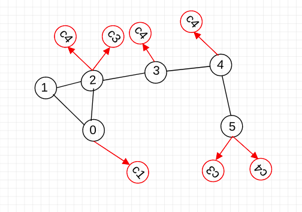

#### Problem Statement:
    Given a connected User-Conent graph(Like Social Media). There are two types of edges
        1.  Friendship Links(Undirected) from user to user
        2.  Sharing Links(Directed) from user to the content that user has shared

##### Input Format:
    n (Number of users)
    <user id 1>: <list of users connected to user 1>
    to
    <user id n>: <list of users connected to user n>

    m (Number of contents)
    <user id 1>: <list of contents posted by user 1>
    to
    <user id n>: <list of contents posted by user n>

##### Task1:
    * Given 'userID' and varaible 'K'. Find first k recommended contents in increasing order of their distances from user 'userID' such that none of the recommended content is itself shared by 'userID'. 
    * Approach: 
        * Use Dijkastra (or BFS)
    * Files : Task1.c (Code) | a2_task1_input.txt (TestCase)

##### Task2:
    * Given graph, 'userID', varaible 'k' and variable 'L'. Find first 'L' recommended users in decreasing order of their 'RelationValue' from user 'userID' such that none of the recommended user is already friend with 'userID'.
    * For a user 'uj', RelationValue is count of contents 'ci' such that
        * distance(userId,ci) <=k && distance(userId,ci) <= k 
    * Approach: 
        * Along with actual graph, Maintain a Hypothetical Reverse Graph which store edges from content to pulisher User.
        * First find all the contents that are atmost 'k' distance from 'userID'. Let this list be 'O'.
            * Now for each content(ci) in list 'O', find users which are at a distance of '1' using Reversed Graph. Let this list be 'W'.
                * Now for each user(ui) in list 'W', find users(up,up+1...uq) which are atmost at distance of 'k-1'.
                (As 'ui' is at distance of '1' from 'ci' and (up,up+1...uq) are atmost 'k-1' distance from 'ui'. This (up,up+1...uq) are  atmost 'k' distance from 'ci'. And that's what we need)
            
    * Files : Task2.c (Code) | task2_input1.txt (TestCase)

##### Task3:
    * Given 'userID' and varaible 'K'. Find first k recommended contents in increasing order of their distances from user 'userID' such that none of the recommended content is itself shared by 'userID'.
    * In addition to task1, here links between user and content have one more property called visibility(Public, friends, friends of friends)
    * If a content is "Public" visible then its distance from any user will be considered as 1.
    * If content is "Only Firends" visible then its distance from any user will be considered as  actalDistance - 1.
    * If content is "Firend of Firends" visible then its distance from any user will be considered as  actalDistance - 2.
    * It is obvious that distance cant be zero, so for example, if content is at distance 2 from me but its publisher user published it with "Firend of Firends" visiblility then its distance from me will be 1 (NOT 0). So just keep it simple that distance cant be less than 1.
    
    * Approach: 
        * Use Dijkastra (or BFS)
    * Files : Task3.c (Code) | task3_sample.txt (TestCase)
